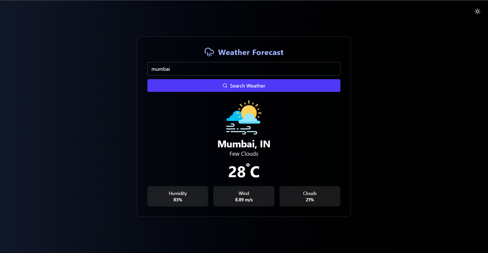
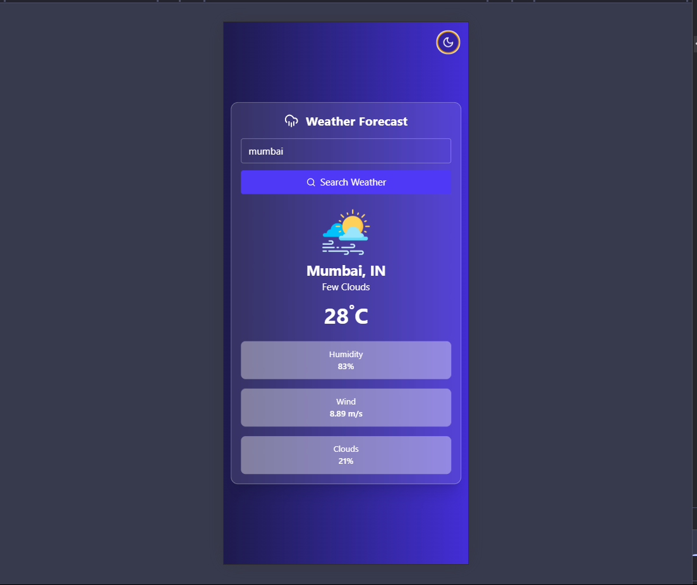
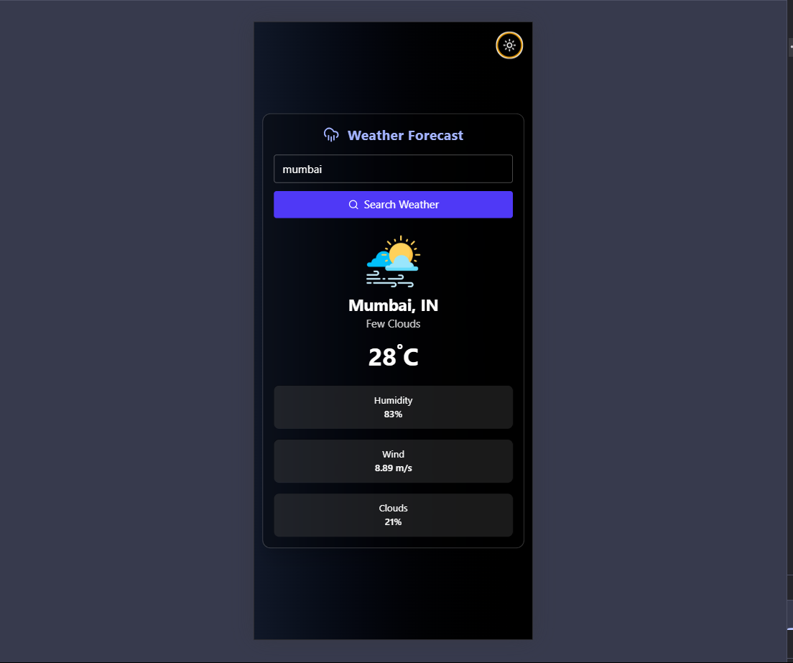
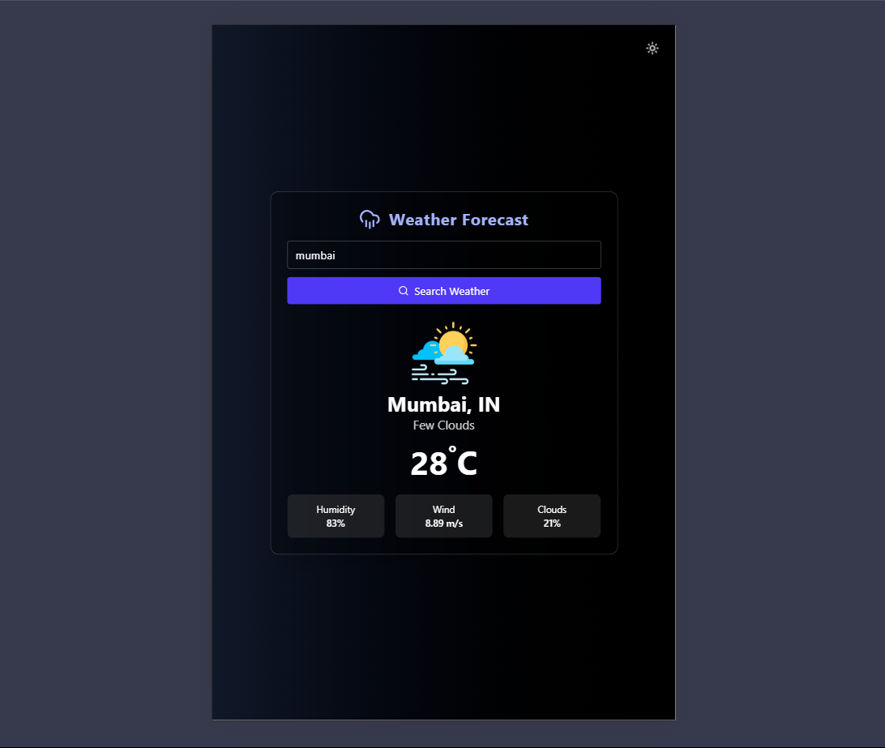
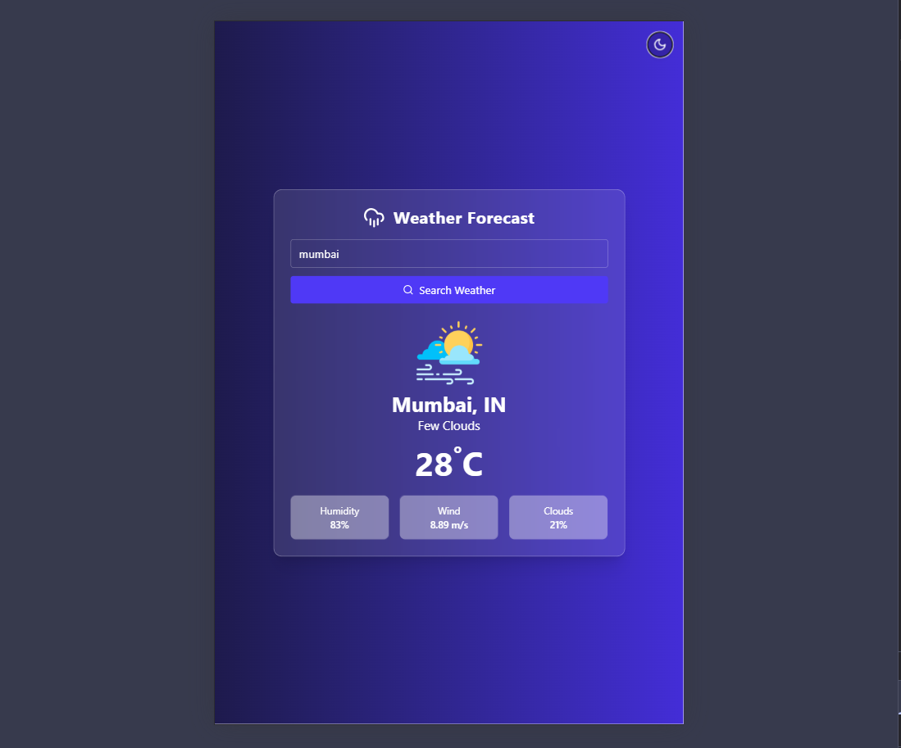

# 🌤️ Weather Forecast App

A simple and responsive weather app built using **React (Vite)** and **Tailwind CSS**. Users can search current weather by city name. Includes dark/light theme support.

---

## 📦 Tech Stack

- React (with Vite)
- Tailwind CSS
- Lucide React Icons
- OpenWeatherMap API

---

## 🚀 Features

- Search weather by city name
- Temperature, humidity, wind, and cloud info
- Responsive design (mobile, tablet, desktop)
- Dark and light theme support
- Error handling for invalid city
- Weather icon and city/country display
- Clean, modern UI

---

---

## 📸 Screenshots

### 🌐☀️ Desktop light View


---

### 🌙 Desktop Dark View



### 📱☀️ Mobile light View



---

### 📱🌙 Mobile Dark View



### Tablet Dark Mode



---

### Tablet Light Mode



## 🛠️ Installation

```bash
# Clone the repository
git clone https://github.com/your-username/weather-app.git

# Go to the project directory
cd weather-app

# Install dependencies
npm install
```
